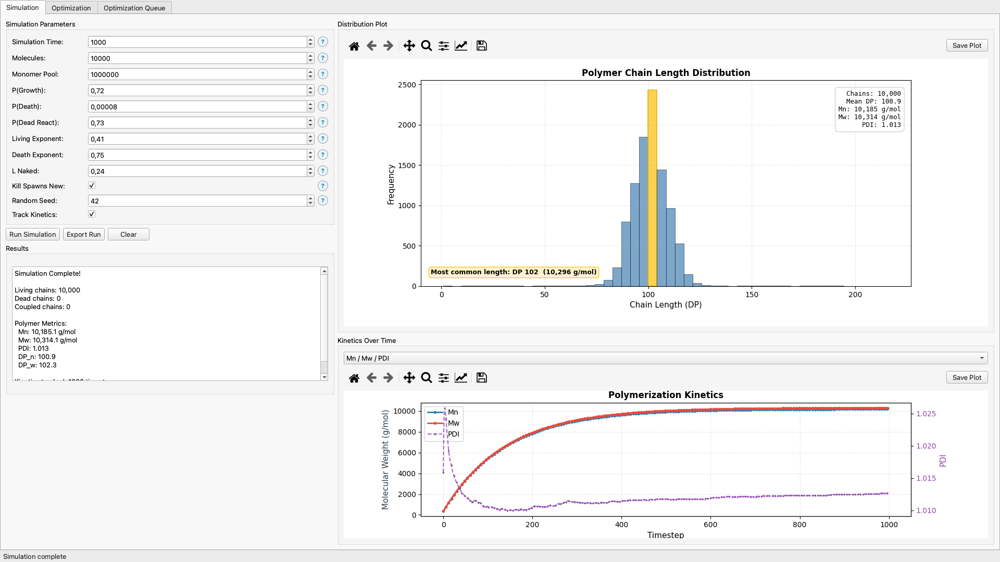
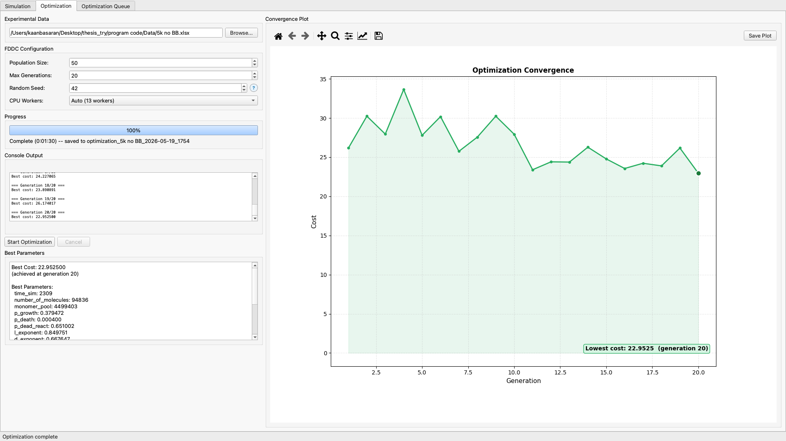
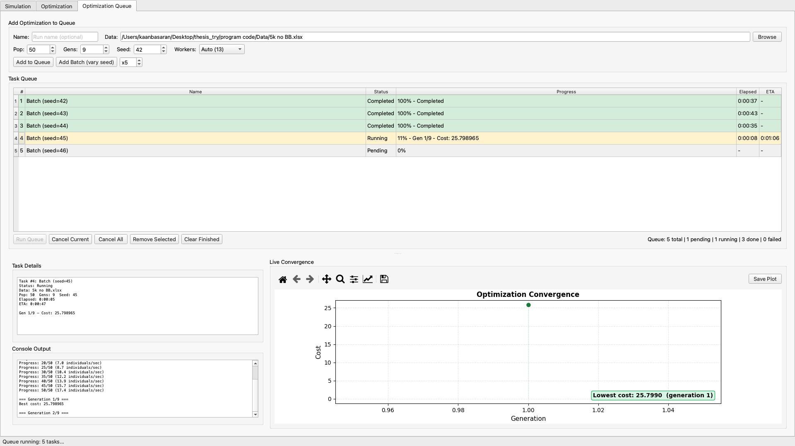

# User Manual

The GUI is launched with `polymer-sim gui`. The window has three tabs: Simulation, Optimization, and Optimization Queue. Each tab is a self-contained workflow with its own controls, console, and plots. Long-running work runs on a Qt worker thread, so the interface stays responsive during simulation and optimisation.

## Simulation tab

The Simulation tab runs one stochastic simulation at a fixed parameter set and visualises the result.

**Controls (left panel):**
- *Simulation Time* (100–10000): number of timesteps.
- *Molecules* (1000–100000): initial number of polymer chains.
- *Monomer Pool*: initial monomer count, or `-1` for an infinite pool.
- *p Growth* (0–0.99), *p Death* (1e-5 to 0.01), *p Dead React* (0.1–0.99): per-step growth, termination, and vampiric coupling probabilities.
- *Living Exponent*, *Dead Exponent*, *L Naked* (0.1–0.99): exponents in the length-dependent vampiric coupling probability.
- *Kill Spawns New*: when checked, a terminated chain is replaced by a new chain of length one; when unchecked, terminated chains are removed.
- *Random Seed*: integer seed for the `numpy.random.Generator`.
- *Track Kinetics*: when checked, records Mn, Mw, PDI, monomer pool, and conversion at every timestep.

**Outputs (right panel):**
- *Distribution Plot*: histogram of final chain lengths across living, dead, and coupled pools, with summary statistics (mean, peak DP, Mn, Mw, PDI, count).
- *Kinetics Over Time* (when tracking is enabled): Mn, Mw, and PDI as a function of timestep.
- *Results* text panel: numerical summary of the run.

**Buttons:**
- *Run Simulation* starts the run. The status bar shows progress; cancellation is immediate.
- *Export Results* opens a directory chooser and writes `params.json`, `distribution.json`, the kinetics CSV when present, and PNG copies of both plots.
- *Clear* discards the current run and resets the plots.

## Optimization tab

The Optimization tab fits the ten simulation parameters to an experimental gel permeation chromatogram using the FDDC algorithm.

**Controls (left panel):**
- *Experimental Data*: Excel file (`.xlsx`) with two columns, chain length and intensity. The example datasets at `program code/Data/5k no BB.xlsx`, `10k no BB.xlsx`, `20k no BB.xlsx`, and `30k no BB.xlsx` are the included reference datasets.
- *Population Size* (10–200): solution-population size for FDDC. Default 50; 100 is a reasonable larger value for harder fits.
- *Max Generations* (5–100): generation cap. Reasonable starting points for the 5k, 10k, 20k, and 30k example datasets are 42, 56, 44, and 27 generations respectively.
- *Random Seed*: integer seed. Equal seeds produce bitwise-identical cost histories (verified by `exp_determinism.py`).
- *CPU Workers*: number of subprocesses in the evaluation pool. *Auto* picks `cpu_count - 1`.

**Outputs:**
- *Convergence Plot*: best cost per generation. Updates live as the optimisation runs.
- *Console Output*: per-generation log (cost, time, ETA) and FDDC internal messages.
- *Best Parameters*: text panel with the lowest-cost parameter vector found so far.
- *Progress* bar and status label.

**Buttons:**
- *Start Optimization* starts the run on a Qt worker thread. The button changes to *Cancel* while running; cancellation finishes the current generation and stops.
- *Export Results* opens a directory chooser and writes `config.json`, `optimization_results.json` (best parameters, best cost, cost history), `cost_history.csv`, and a PNG of the convergence plot.

## Optimization Queue tab

The Optimization Queue tab is the workflow for batches of long-running optimisations, such as 30–40 minute jobs run across multiple datasets.

**Add to Queue (top panel):**
- *Name*: human-readable label for the run.
- *Data file*: experimental Excel file.
- *Population Size*, *Generations*, *Random Seed*, *CPU Workers*: same meanings as on the Optimization tab.
- *Add to Queue* appends one task; *Add Batch (seeds N)* appends N tasks with consecutive seeds, for replicate runs at a fixed configuration.

**Task Queue table:**
Each row is a task. Columns show name, status (Pending, Running, Completed, Failed, Cancelled), progress percentage, elapsed time, and ETA. Selecting a row shows that task's console log and convergence plot in the lower panels.

**Buttons:**
- *Start Queue* runs pending tasks one at a time. The active task's console and plot update live.
- *Cancel Current* aborts the running task and moves on to the next pending one.
- *Cancel All* aborts everything pending.
- *Remove Selected*, *Clear Finished* manage the table.

**Outputs:**
Each completed task writes its run directory to the location chosen at queue start time: `config.json`, `optimization_results.json`, `cost_history.csv`, and `convergence.png`. Failed tasks record their traceback in the console pane and in an `error.log` alongside the partial outputs.
